<p align="center">
  
</p>

<p align="center">
  
  
  
</p>

Most fitness apps hand everyone the same plan. This one starts from you: age, height, weight, activity
level, goal, and diet. From that it builds a full week of meals and training, tells you how much
water to drink, and projects where your weight is heading.

## Features

- **Profile:** enter your stats, activity level, goal (bulk, cut, maintain), and dietary preference.
- **7-day meal plan:** five meals a day with portions, and calories, protein, carbs, and fat for every meal and every day.
- **Workout plan:** a weekly training split matched to your goal.
- **Casual or Advanced mode:** a simple plan, or one with more structure and detail.
- **Hydration target:** a daily water recommendation based on your weight and activity.
- **Weight projection:** a Plotly chart of where your weight goes if you follow the plan.
- **Coach chat:** ask GPT-4 follow-up questions about your plan.

## Run it

```bash
python -m venv venv
venv\Scripts\activate          # macOS/Linux: source venv/bin/activate
pip install -r requirements.txt
```

Create a `.env` file next to `fitnessapp.py`:

```
OPENAI_API_KEY=your-key-here
```

Then start the app:

```bash
streamlit run fitnessapp.py
```

`.env` is already in `.gitignore`, so your key stays out of git.
